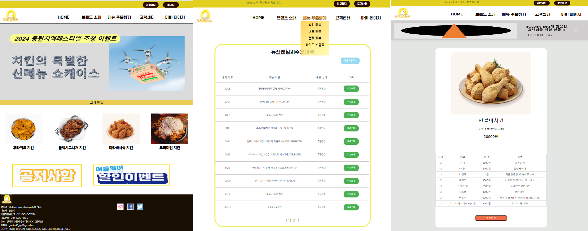

    

    배포주소 : 34.64.140.53/GoldenEGG
    테스트 계정(사용자) : ID:lemon3 / PW:7777
    테스트 계정(관리자) : ID:MASTER / PW:9999    

 
    <h2 style="border-bottom: 1px solid #d8dee4; color: #282d33;"> 골든에그 치킨 주문 및 딜리버리 </h2>  
     
 주제 : 치킨 주문 및  매장관리 사이트  
      기능 : 로그인 후 메뉴 주문, 마이페이지(찜목록, 주문내역, 나의 리뷰)에 접근이  
         가능하며 비회원일 경우 접근 불가합니다. 
         메뉴 주문 시 사이드 메뉴 선택 후 장바구니에 담기고 결제를 할 수 있습니다. 
         마이페이지에서 회원의 주문내역과 찜목록을 조회할 수 있고 리뷰 작성 및 조회가 가능합니다.  
      성과 : 각각 담당 페이지를 담당하면서 CRUD 작업 능력이 향상되었습니다. 
         쿼리문을 통해 데이터를 관리하고 조회할 수 있었습니다. 
         세션, AJAX, JQUERY, 첨부파일 업로드 등 새롭고 다양한 기술을 익힐 수 있었습니다.
     
 

    <h2 style="border-bottom: 1px solid #d8dee4; color: #282d33;"> 🛠️ Tech Stacks </h2>
     
    

        
        
        
        
        
         
        
        
        
        
        
        
        
    

    <h2 style="border-bottom: 1px solid #d8dee4; color: #282d33;"> 🧑‍💻 Contact me </h2>
     

    <h2 style="border-bottom: 1px solid #d8dee4; color: #282d33;"> 🏅 Stats </h2>
    

        
        <h2>개발자 : 송유미</h2>        
        
        <h2>개발자 : 홍성우</h2>        
        
        <h2>개발자 : 김어진</h2>      
        
        <h2>개발자 : 김정재</h2>
    

